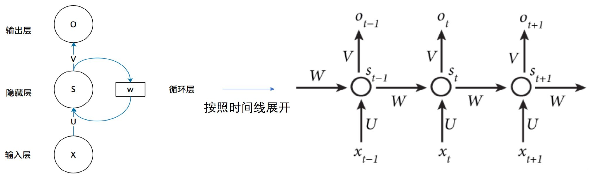
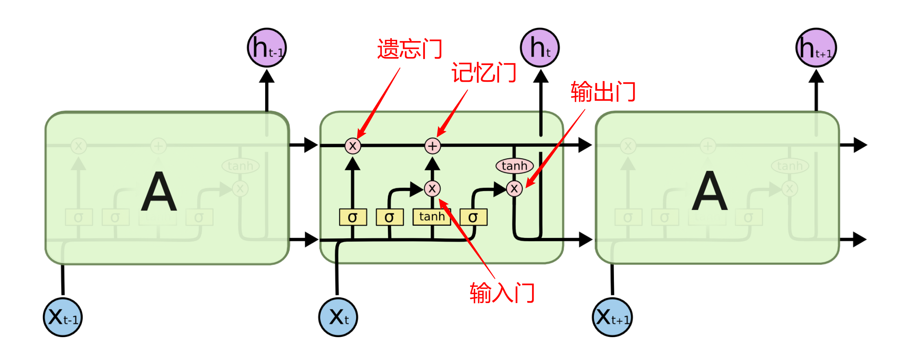

# 医患对话理解-命名实体识别


## 实验介绍

本实验使用MindSpore框架，利用LSTM循环神经网络进行命名实体识别任务。

### 循环神经网络

- 原始循环神经网络：当使用RNN处理一个序列输入时，需要RNN按输入时刻展开，然后将序列中的每个输入一次对应到网络不同时刻的输入上，并将当前时刻网络隐含层的输出作为下一时刻的输入。

  - $s_t=\text{tanh}(U\cdot x_t+b^U+W\cdot s_{t-1}+b^W)$

  > $\text{tanh}(z)=\frac{e^z-e^{-z}}{e^z+e^{-z}}$是激活函数，形状与Sigmoid函数类似，不过其值域为(-1, 1)

  - $o_t=\text{Softmax}(V\cdot s_t+b^V)$



- [长短时记忆网络](http://colah.github.io/posts/2015-08-Understanding-LSTMs/)：克服了原始神经网络对长远记忆的遗忘问题
  - 引入了记忆细胞，存储重要记忆
  - 通过遗忘门决定记忆细胞需要丢弃的记忆
  - 通过输入门确定记忆细胞需要新增的记忆
  - 通过记忆门更新记忆细胞
  - 通过输出门融合记忆与当前信息，输出结果



### 命名实体识别

- 含义：在文本中抽取每个提及的命名实体并标注其类型，包括人名、地名和机构名等，也包括专有名称如书名、电影名和药物名。

- 序列分割：将字符序列切分成若干连续的子序列，对于命名实体识别而言，输出标签为
  - 实体的开始字符：B-XXX，其中B代表Begin，XXX代表实体类型，可以是人名（PER）、地名（LOC）和机构名（ORG）等
  - 实体的中间字符：I-XXX，其中I代表Inside
  - 非实体：O，其中O代表Other
- 示例

| 输入             | 我   | 爱   | 北    | 京    | 天    | 安    | 门    | 。   |
| ---------------- | ---- | ---- | ----- | ----- | ----- | ----- | ----- | ---- |
| 分词输出         | B    | B    | B     | I     | B     | I     | I     | B    |
| 命名实体识别输出 | O    | O    | B-LOC | I-LOC | B-LOC | I-LOC | I-LOC | O    |

### 医患对话理解

- 任务内容：从医患对话文本中识别出七类重要医疗相关实体，即在医疗数据集上执行命名实体识别任务。

- 数据集：2000余组医患对话
- 实体标签：12种
  - O：Other
  - \<pad>：补齐标签
  - B-Symptom、I-Symptom：症状
  - B-Drug、I-Drug：药物
  - B-Drug_Category、I-Drug_Category：药物类别
  - B-Medical_Examination、I-Medical_Examination：医学检查
  - B-Operation、I-Operation：操作（打针、抽血、手术等）
- 示例

| 编号 | Input（对话）                        | Output （BIO标签）                                           |
| ---- | ------------------------------------ | ------------------------------------------------------------ |
| 1    | 医生：有没有发热                     | O O O O O O O B-Symptom I-Symptom                            |
| 1    | 患者：没有                           | O O O O O                                                    |
| 2    | 医生：应用什么药物                   | O O O O O O O O O                                            |
| 2    | 患者：给喝过小儿咳喘灵，阿莫西林颗粒 | O O O O O O B-Drug I-Drug I-Drug I-Drug O B-Drug I-Drug I-Drug I-Drug I-Drug I-Drug |

## 实验环境

- Ubuntu + MindSpore
- Windows + Pycharm专业版

## 实验步骤

1. 将原始语料（original_dataset.json）加工成训练集（train.txt）、验证集（dev.txt）和测试集（test.txt）

```python
import json


def main():
    with open('original_dataset.json', mode='r') as fp:
        source = json.load(fp)
    sentences = []
    labels = []
    examples = source.values()
    for example in examples:
        dialogue = example['dialogue']
        for element in dialogue:
            sentences.append(element['sentence'])
            labels.append(element['BIO_label'])
    print('sentences length: ' + str(len(sentences)) + ', labels length: ' + str(len(labels)))
    i = 0
    length = len(sentences)
    limit = int(0.8 * length)
    with open('train.txt', mode='w') as fp:
        while i < limit:
            fp.write(sentences[i] + '\n')
            fp.write(labels[i])
            if i < limit - 1:
                fp.write('\n')
            i += 1
    train_size = i
    print('train set size: ' + str(train_size))
    limit = int(0.9 * length)
    with open('dev.txt', mode='w') as fp:
        while i < limit:
            fp.write(sentences[i] + '\n')
            fp.write(labels[i])
            if i < limit - 1:
                fp.write('\n')
            i += 1
    dev_size = i - train_size
    print('dev set size: ' + str(dev_size))
    with open('test.txt', mode='w') as fp:
        while i < length:
            fp.write(sentences[i] + '\n')
            fp.write(labels[i])
            if i < length - 1:
                fp.write('\n')
            i += 1
    print('test set size: ' + str(length - train_size - dev_size))


if __name__ == '__main__':
    main()

```

2. 建立长短时记忆模型

```python
from mindspore import nn, Tensor
import numpy as np
import mindspore
from mindspore.common.initializer import initializer

class BasicModel(nn.Cell):
    def __init__(self, vocab_size: int, embedding_dim: int, hidden_size: int,
                 hidden_num_layer: int, label_size: int, batch_size: int = 64):
        # vocab_size 词表大小
        # embedding_dim 字向量维度
        # hidden_size 隐含层向量维度
        # hidden_num_layer 隐含层层数
        # label_size 标签类别数
        super(BasicModel, self).__init__()
        self.embedding = nn.Embedding(vocab_size=vocab_size, embedding_size=embedding_dim)  # 将字索引转换成字向量
        self.hidden_size = hidden_size
        # 将隐含层结构设置为长短时记忆网络
        # cuDNN（基于CUDA的深度学习GPU加速库）中RNN的API的batch_size在第二维度，便于并行计算
        # 但是习惯上，我们会将batch_size设为第一维度，即设置batch_first=True
        self.hidden = nn.LSTM(input_size=embedding_dim, hidden_size=hidden_size, num_layers=hidden_num_layer,
                              batch_first=True, bidirectional=True)
        # 初始化隐状态
        self.h0 = initializer('zeros', [2 * hidden_num_layer, batch_size, hidden_size], dtype=mindspore.float32)
        # 初始化记忆细胞
        self.c0 = initializer('zeros', [2 * hidden_num_layer, batch_size, hidden_size], dtype=mindspore.float32)
        # 设置全连接层
        self.linear = nn.Dense(in_channels=2 * hidden_size, out_channels=label_size)
        self.isTraining = True

    def construct(self, inputs: mindspore.Tensor):
        outputs = self.embedding(inputs)
        outputs, _ = self.hidden(outputs, (self.h0, self.c0))
        outputs = self.linear(outputs)
        return outputs


    def set_batch_size(self, batch_size):
        self.h0 = initializer('zeros', [2 * self.hidden.num_layers, batch_size, self.hidden_size], dtype=mindspore.float32)
        self.c0 = initializer('zeros', [2 * self.hidden.num_layers, batch_size, self.hidden_size], dtype=mindspore.float32)
```

3. 训练

```Python
def train():
    # 获得字表、字典
    vocab, dictionary = v.get_vocab_and_dictionary()
    # 获得训练数据集（句子的字索引+句子的字标签索引）
    dataset = d.get_dataset('dev.txt', dictionary).batch(256, drop_remainder=True)
    # 建立LSTM神经网络
    basic_model = BasicModel(vocab_size=len(vocab), embedding_dim=30, hidden_size=40, hidden_num_layer=2, label_size=12)

    # 尝试寻找模型参数文件，若存在，则直接加载模型
    try:
        param_dict = mindspore.load_checkpoint('model.ckpt')
        mindspore.load_param_into_net(basic_model, param_dict)
    except ValueError:
        print('未找到模型参数文件，将使用随机初始化参数')
        pass
    # 损失函数
    loss_fn = BasicLoss()
    # 优化器
    optimizer = nn.Adam(basic_model.trainable_params(), learning_rate=0.01)
    # 设置批次大小
    basic_model.set_batch_size(256)
    # 建立完整模型
    model = mindspore.Model(network=basic_model, loss_fn=loss_fn, optimizer=optimizer)
    # 训练
    model.train(epoch=10, train_dataset=dataset, callbacks=[LossMonitor(), TimeMonitor(),
                                                            SummaryCollector(summary_dir='/root/summary/baseline1', collect_freq=10)], dataset_sink_mode=False)
    # 保存参数
    mindspore.save_checkpoint(basic_model, 'model.ckpt')
    print('训练完成，模型已保存')
```

4. 测试

```Python
def evaluate_f1():
    vocab, dictionary = v.get_vocab_and_dictionary()
    # 获得测试数据集
    dataset = d.get_dataset('test.txt', dictionary).source
    basic_model = BasicModel(vocab_size=len(vocab), embedding_dim=30, hidden_size=40, hidden_num_layer=2, label_size=12)
    # 加载训练好的模型
    try:
        param_dict = mindspore.load_checkpoint('model.ckpt')
        mindspore.load_param_into_net(basic_model, param_dict)
    except ValueError:
        pass
    length = len(dataset)
    basic_model.set_batch_size(length)
    f1_net = BasicF1()
    inputs, targets = dataset[0:length] # 获得inputs(句子)、targets(答案标签)
    inputs = Tensor(np.array(inputs))   # 将inputs转换成张量
    targets = Tensor(np.array(targets)) # 将targets转换成张量
    outputs = basic_model(inputs)       # 通过模型获得预测标签
    f1_net.clear()
    f1_net.update(outputs, targets)
    f1 = f1_net.eval()  # 计算f1值
    print('f1: ', f1)


def evaluate_acc():
    vocab, dictionary = v.get_vocab_and_dictionary()
    basic_model = BasicModel(vocab_size=len(vocab), embedding_dim=30, hidden_size=40, hidden_num_layer=2, label_size=12)
    # 加载训练好的模型
    try:
        param_dict = mindspore.load_checkpoint('model.ckpt')
        mindspore.load_param_into_net(basic_model, param_dict)
    except ValueError:
        pass
    inputs, targets = d.get_dataset('test.txt', dictionary, padding=False)  # 获得inputs(句子)、targets(答案标签)
    length = len(inputs)
    basic_model.set_batch_size(1)
    eval_net = BasicEvaluation()
    i = 0
    total_acc = 0
    # 计算ACC
    while i < length:
        outputs = basic_model(Tensor(np.array(inputs[i:i + 1])))
        eval_net.clear()
        eval_net.update(outputs, Tensor(np.array(targets[i:i + 1])))
        acc = eval_net.eval()
        print(i, acc)
        total_acc += acc
        i += 1
    print('acc: ', total_acc / i)
```

